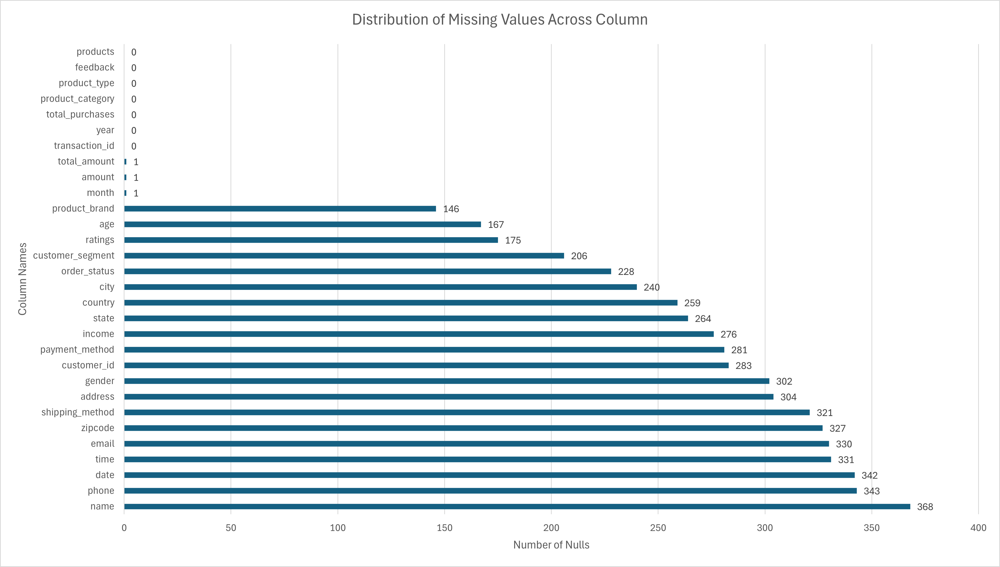
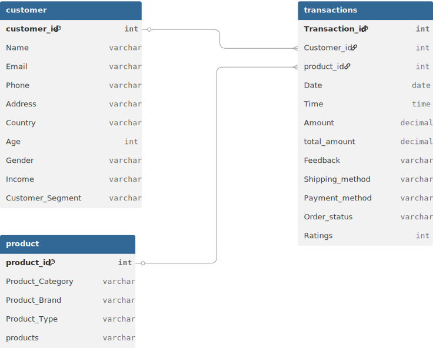
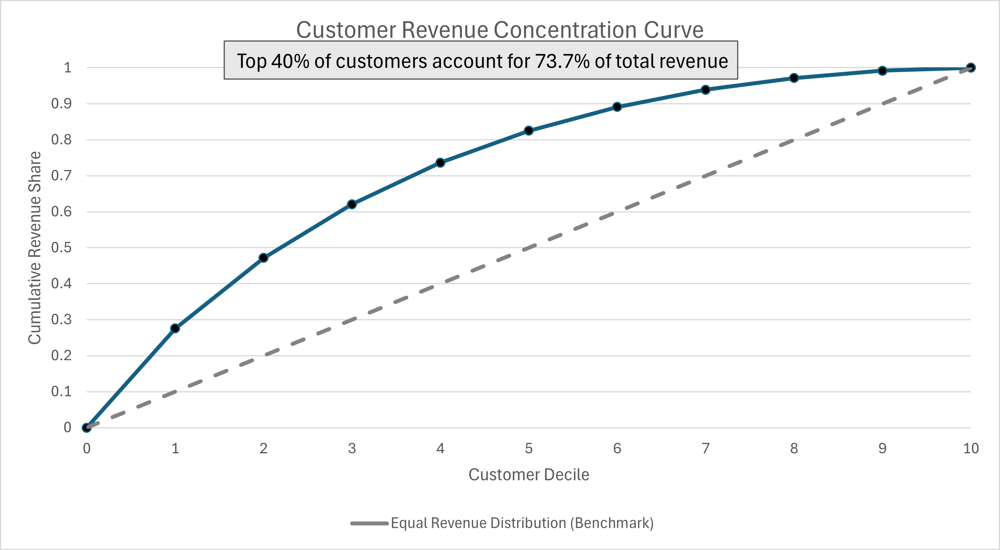
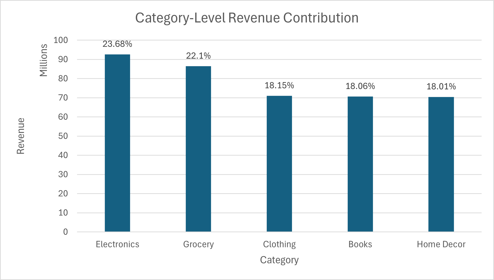

# SQL Retail Data Analysis
End-to-end SQL-based data cleaning, transformation, and analysis of retail transaction data to generate actionable business insights.

# Overview
This project analyzes retail transaction data to understand how revenue is distributed across products, customers, geography, and time. Using SQL, the data was ingested, cleaned, normalized, and analyzed to identify revenue concentration, key revenue drivers, and growth patterns relevant to business decision-making.

# Business Question
**How is company revenue distributed across customers, products, geography, and time, and where is it most concentrated?**

# Dataset Description
- Source: Kaggle
- Original Structure: Single retail transaction table
- Size: 302010 rows x 30 columns

For analysis, the data was normalized into three relational tables to better reflect real-world data structure.
    - **customer**: customer-level attributes (e.g., customer_id, customer_segment, country)
    - **product**: product-level attributes (e.g., product_id, product_category, product_brand)
    - **transactions**: order-level attributes (e.g., transaction_id, customer_id, product_id, order_date, total_amount)
    The tables were joined using primary and foreign keys during analysis.

# Tools used
- SQL (MySQL)
- Git & Github
- MySQL Workbench

# Data Ingestion
- Created a MySQL database to store retail transaction data
- Defined a raw staging table to ingest unprocessed data
- Loaded raw CSV data into MySQL using bulk import for efficient ingestion

# Data Cleaning & Standardization
- Removed exact duplicate records and transactions with missing transaction IDs
- Identified and categorized duplicate transaction IDs to distinguish duplicates from data quality issues
- Persisted data quality flags in a separate diagnostic table to avoid impacting downstream analysis
- Standardized data and time fields and enforced appropriate data types
- Reconstructed missing monetary values using internally consistent transaction metrics
- Resolved missing product attributes by leveraging related product fields
- Implemented cleaning and standardization logic prior to data normalization

# Exploratory Data Analysis
- Assessed data completeness and validated key assumptions (e.g., transaction-level uniqueness, customer non-uniqueness)
- Verified financial consistency across monetary fields and checked for invalid or conflicting values
- Explored geographic and demographic distribution of transactions and customers
- Analyzed temporal patterns, including yearly and monthly transaction volume trends
- Identified and documented data quality issues, including inconsistent city-state mappings

# Data Modeling
- Normalized the cleaned dataset into three relational tables: customer, product, and transactions
- Generated surrogate primary keys for customers and products to resolve duplication and ensure uniqueness
- Designed the transactions table as a bridge entity linking customers and products
- Enforced referential integrity using primary and foreign key constraints
- Unnecessary and broken columns were removed to reduce redundancy, improve data quality, and keep schema focused on analytically meaninful attributes

# Analysis
- Quantified overall business performance including total revenue, order volume, and average order value by customer segment
- Analyzed revenue concentration using deciles and cumulative share metrics to identify high-impact customers

- Segmented customers into spending tiers and evaluated transaction behavior across segments
- Identified top-performing customers within each customer segment
- Evaluated revenue contribution by brand, category, and product type, including focused analysis on Electronics

- Analyzed geographic revenue distribution and concentration across countries
- Measured month-to-month revenue growth from March 2023 to February 2024

# Key Insights
- Average order value was relatively consistent across customer segments (New, Regular, Premium), with minimal variation between groups. Additionally, the highest-spending customers within each segment exhibited similar spending ranges, indicating that segment labels alone were not strong predictors of spending behavior.
- Revenue was highly concentrated among top customers: the top 40% of customers (top 4 deciles) accounted for approximately 73.7% of total revenue.
- When customers were segmented into three spending tiers, the average total spend per customer increased sharply across tiers (Low: $306.04, Medium: $1,077.52, High: $2,723.20) highlighting clear stratification in customer value.
- Revenue was moderately diversified across brands and categories. Pepsi alone contributed 10% of total revenue, while most other brands contributed approximately 6% each. Electronics was the top-performing category (23.7% of total revenue), followed by Grocery (22.1%), Clothing (18.2%), Books (18.1%), and Home Decor (18%).
- Within Electronics, Smartphones alone accounted for 25.9% of category revenue, making them the single most dominant product type.
- Month-to-month revenue showed minimal fluctuation, indicating stable performance but limited growth over the observed period.
- Revenue was heavily concentrated in a few core markets. The U.S., UK, and Germany together generated 70% of total revenue, with the U.S. alone contributing 31.6%. This suggests that overall performance is highly dependent on a small number of geographic regions. 

# Business Recommendations
- **Prioritize retention of high-value customers.**
Since the top 40% of customers generate approximately 73.65% of total revenue, the business should focus on loyalty programs, personalized offers, and retention strategies targeted at high-spending customers to protect its primary revenue base.
- **Reevaluate current customer segmentation**
Because New, Regular, and Premium segments showed minimal differences in average order value and top spending ranges, the current segmentation may not effectively differentiate customer value. A value-based segmentation using actual spending tiers(low,medium,high) may better support targeted marketing and personalization efforts.
- **Invest more heavily in top-performing product types**
Smartphones accounted for 25.9% of Electronics revenue, making them the dominant product type in the category. Marketing spend, product placement, and inventory planning should prioritize these high-performing products.
- **Strengthen focus on core revenue-drivivng categories while maintaining diversification**
Electronics and grocery together accounted for nearly half of total revenue. These categories should receive greater strategic attention, while the relatively balanced distribution across other categories provides an opportunity for cross-selling and bundling.
- **Reduce geographic dependency risk**
While approximately 70% of revenue coming from just three countries (U.S., UK, Germany), the business is highly exposed to regional economic or regulatory changes. Exploring growth opportunities in underrepresented markets could improve long-term stability.
- **Develop growth-focused strategies**
Month-to-month revenue trends showed stability but little growth. The business should explore new customer acquisition channels, product expansion, or promotional strategies to drive sustained revenue growth.